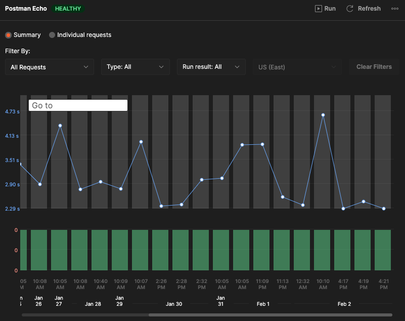
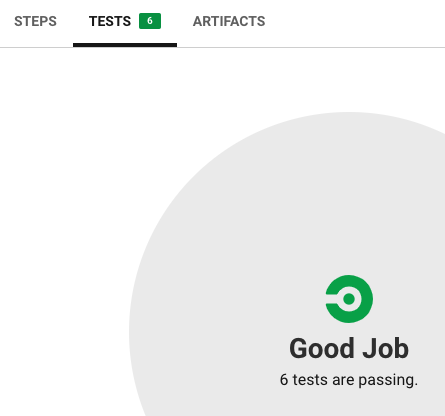
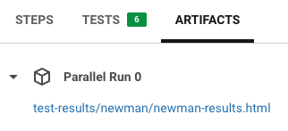
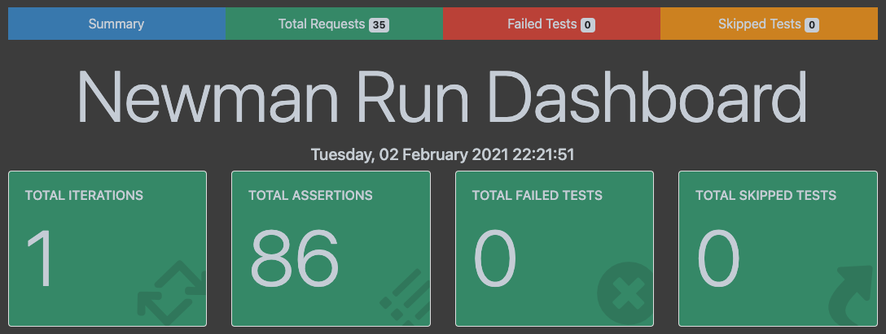

# AIO-BEO

[](https://circleci.com/gh/evanlindsey/AIO-BEO)

**How to execute Postman Collections through the Monitor API or the Newman Javascript library using Mocha.**

## Resources

[Postman - Generating an API Key](https://learning.postman.com/docs/developer/intro-api/#generating-a-postman-api-key)

[Postman - Forking a Collection](https://learning.postman.com/docs/collaborating-in-postman/version-control-for-collections/#forking-a-collection)

[Postman - Creating a Monitor](https://learning.postman.com/docs/designing-and-developing-your-api/monitoring-your-api/setting-up-monitor/#creating-a-monitor)

## Retrieving IDs

**Collection**


**Monitor**


## Environment Variables

- API Key -- PM_API_KEY
- Collection ID -- PM_COLLECTION_ID
- Monitor ID -- PM_MONITOR_ID

## Local Execution

```zsh
npm install
export PM_API_KEY=***
export PM_COLLECTION_ID=***
export PM_MONITOR_ID=***
npm test
npm run test-newman
npm run test-monitor
npm run test-parallel
```

## Invoke Monitor

```javascript
// Post Request to Monitor API
const response = await axios.post(
  `https://api.getpostman.com/monitors/${monitorId}/run?apikey=${apiKey}`,
  {}
);

// Format and Log Response
runData = response.data.run;
for (const entry of runData.executions) {
  const req = entry.request;
  const res = entry.response;
  console.log(`\n${entry.item.name}`);
  console.log(
    `${req.method} ${req.url} [${res.code}, ${res.responseSize}B, ${res.responseTime}ms]`
  );
}
```

## Invoke Newman

```javascript
// Await Newman Response as Promise
await new Promise((resolve, reject) => {
  newman
    .run({
      collection: `https://api.getpostman.com/collections/${collectionId}?apikey=${apiKey}`,
      reporters: ["cli"],
    })
    .on("done", (error, summary) => {
      if (error) {
        reject(error);
      }
      resolve(summary);
    });
});
```

## CircleCI

[CircleCI - Setting Environment Variables](https://circleci.com/docs/2.0/env-vars/#setting-an-environment-variable-in-a-project)


### Configuration

[CircleCI - Workflows Configuration Examples](https://circleci.com/docs/2.0/workflows/#workflows-configuration-examples)

[.circleci/config.yml](.circleci/config.yml)

```yaml
version: 2.1

orbs:
  node: circleci/node@4.1.0

jobs:
  test:
    executor:
      name: node/default
      tag: "14.15.4"
    steps:
      - checkout
      - node/install-packages
      - run:
          command: npm test
      - store_test_results:
          path: test-results
      - store_artifacts:
          path: test-results/newman/html-results.html

workflows:
  newman-and-monitor:
    jobs:
      - test
```

## Reporting

### Monitor Dashboard (Postman)



### Mocha JUnit (CircleCI)



### Newman Artifact (CircleCI)



### Newman htmlextra



## NPM Packages

### Test Libraries

[https://github.com/postmanlabs/newman](https://github.com/postmanlabs/newman)

[https://github.com/mochajs/mocha](https://github.com/mochajs/mocha)

### Reporters

[https://github.com/DannyDainton/newman-reporter-htmlextra](https://github.com/DannyDainton/newman-reporter-htmlextra)

[https://github.com/stanleyhlng/mocha-multi-reporters](https://github.com/stanleyhlng/mocha-multi-reporters)

### Utilities

[https://github.com/standard-things/esm](https://github.com/standard-things/esm)

[https://github.com/axios/axios](https://github.com/axios/axios)

[https://github.com/chaijs/chai](https://github.com/chaijs/chai)
