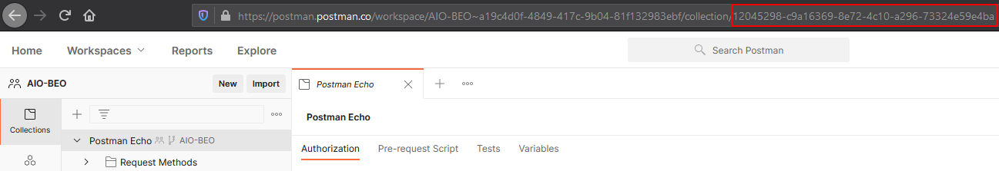

# AIO-BEO

[](https://circleci.com/gh/evanlindsey/AIO-BEO)

**How to execute Postman Collections through the Monitor API or the Newman Javascript library using Mocha.**

## Resources

[Postman - Generating an API Key](https://learning.postman.com/docs/developer/intro-api/#generating-a-postman-api-key)

[Postman - Forking a Collection](https://learning.postman.com/docs/collaborating-in-postman/version-control-for-collections/#forking-a-collection)

[Postman - Creating a Monitor](https://learning.postman.com/docs/designing-and-developing-your-api/monitoring-your-api/setting-up-monitor/#creating-a-monitor)

## Retrieving IDs

**Collection**



**Monitor**


## Environment Variables

- API Key -- PM_API_KEY
- Collection ID -- PM_COLLECTION_ID
- Monitor ID -- PM_MONITOR_ID

## Local Execution

```zsh
npm install
export PM_API_KEY=***
export PM_COLLECTION_ID=***
export PM_MONITOR_ID=***
npm test
npm run test-newman
npm run test-monitor
```

## Circle CI

[Circle CI - Setting Environment Variables](https://circleci.com/docs/2.0/env-vars/#setting-an-environment-variable-in-a-project)


### Configuration

[Circle CI - Workflows Configuration Examples](https://circleci.com/docs/2.0/workflows/#workflows-configuration-examples)

[.circleci/config.yml](.circleci/config.yml)

```yaml
version: 2.1

orbs:
  node: circleci/node@4.1.0

jobs:
  test:
    executor:
      name: node/default
      tag: "14.15.4"
    steps:
      - checkout
      - node/install-packages
      - run:
          command: npm test
      - store_test_results:
          path: test-results
      - store_artifacts:
          path: test-results/newman/html-results.html

workflows:
  newman-and-monitor:
    jobs:
      - test
```

## Test Libraries

[Newman](https://github.com/postmanlabs/newman)

[Mocha](https://github.com/mochajs/mocha)
